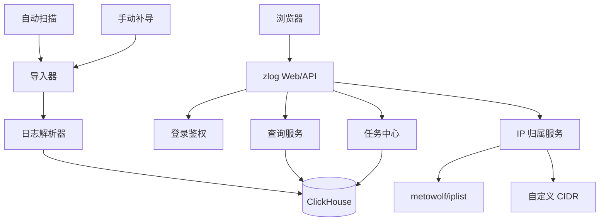

# zlog 轻量 SIEM 子系统设计

## 背景

`zlog` 是一个轻量 SIEM 子系统，面向防火墙 NAT 日志的结构化查询、留存和导出。最终方案采用 Docker Compose + ClickHouse，导入成功后不再依赖源文件作为查询入口。

典型日志文件位于 `/data/sangfor_fw_log`，文件名形如：

```text
10.10.10.1_2026-04-28.log-20260429.gz
192.168.9.13_2026-04-24.log-20260428.gz
```

典型日志行形如：

```text
Apr 28 00:00:23 localhost nat: 日志类型:NAT日志, NAT类型:snat, 源IP:2.55.81.106, 源端口:1799, 目的IP:140.205.70.178, 目的端口:443, 协议:6, 转换后的IP:58.216.48.6, 转换后的端口:1799
```

## 目标

- 以 Docker Compose 方式部署。
- 主数据源为 ClickHouse。
- Web 页面支持登录后查询日志。
- 支持自动扫描导入和页面手动补导。
- 导入成功后不依赖源文件进行查询。
- 只存结构化字段，不存 `raw_line`。
- 支持源 IP、目的 IP、转换后 IP 和全部 IP 字段查询。
- 支持日期级和秒级时间范围查询。
- 目的 IP 显示国家或地区归属。
- 支持自定义 IP 段覆盖目的 IP 归属显示。
- 支持分页查询和异步导出。
- 不提交本地构建产物。

## 核心难点

1. **数据量大**
   - 真实样本中，单个 gzip 约 43 MB，解压后约 613 MB，约 300 万行。
   - 按单设备一年估算，约 10.96 亿行。
   - 不能把原始日志整行长期入库，否则容量会失控。

2. **查询必须快**
   - 核心动作是按时间范围查 IP。
   - 不能依赖扫描原始文件。
   - 必须用列式存储、压缩和合理排序键。

3. **磁盘必须可控**
   - 不能同时长期保留原始日志、完整原文、行级索引和结构化全量表。
   - 要把查询速度和磁盘占用拆开设计。

4. **只能依赖一个主库**
   - 源文件导入成功后，后续查询和导出都必须基于数据库。
   - 这要求主库同时承担检索、统计、导出和留存。

5. **IP 查询路径不唯一**
   - 需要支持源 IP、目的 IP、转换后 IP、全部 IP。
   - 单一排序键不可能让三类 IP 都同样快。
   - 需要接受投影或物化视图的可选成本。

6. **目的 IP 归属要轻量**
   - 需要显示国家或地区归属。
   - 不能把归属系统做成复杂标签平台。
   - 归属计算必须不拖慢主查询。

## 最终决策

- ClickHouse 是唯一主库。
- 源文件只作为导入输入。
- 导入成功后可以删除源文件。
- 不存 `raw_line`。
- 结果展示和导出都基于 ClickHouse。
- 目的 IP 归属在导入时写入 `dst_country`，自定义 CIDR 可覆盖显示名称。

## 总体架构



组件职责：

- `parser`：解析文件名和日志行。
- `store`：封装 ClickHouse 读写。
- `importer`：扫描、去重、解压、批量导入。
- `query`：把页面条件转成 SQL。
- `exporter`：异步导出。
- `jobs`：导入、导出和规则任务状态。
- `ipmeta`：内置 IP 库和自定义 CIDR 归属解析。
- `http`：页面、API、认证和错误响应。

## 数据模型

主表只存结构化字段：

```sql
CREATE TABLE nat_logs
(
    ts DateTime CODEC(Delta, ZSTD(3)),
    log_date Date CODEC(Delta, ZSTD(3)),
    device_ip IPv4 CODEC(ZSTD(3)),
    src_ip IPv4 CODEC(ZSTD(3)),
    src_port UInt16 CODEC(T64, ZSTD(3)),
    dst_ip IPv4 CODEC(ZSTD(3)),
    dst_port UInt16 CODEC(T64, ZSTD(3)),
    protocol UInt8 CODEC(ZSTD(3)),
    translated_ip IPv4 CODEC(ZSTD(3)),
    translated_port UInt16 CODEC(T64, ZSTD(3)),
    log_type LowCardinality(String) CODEC(ZSTD(3)),
    nat_type LowCardinality(String) CODEC(ZSTD(3)),
    dst_country LowCardinality(String) CODEC(ZSTD(3)),
    source_file LowCardinality(String) CODEC(ZSTD(3)),
    line_no UInt32 CODEC(Delta, ZSTD(3)),
    imported_at DateTime CODEC(Delta, ZSTD(3))
)
ENGINE = MergeTree
PARTITION BY toYYYYMM(log_date)
ORDER BY (log_date, dst_ip, ts);
```

说明：

- 不存 `raw_line`。
- `source_file + line_no` 只用于审计来源，不依赖源文件回读。
- 如果后续压测发现源 IP 或转换后 IP 查询明显慢，可以再加 projection。

## 导入流程

1. 扫描 `/data/sangfor_fw_log`。
2. 识别 `*.log`、`*.gz`、`*.log-*.gz`。
3. 从文件名提取 `device_ip`、`log_date`、`archive_date`。
4. 逐行解压读取日志。
5. 解析 NAT 字段。
6. 计算目的 IP 归属和自定义覆盖名称。
7. 批量写入 ClickHouse。
8. 记录文件导入状态、行数、失败行数和任务耗时。

导入成功后：

- 源文件不再作为查询依赖。
- 可以删除或迁移到备份目录。
- 系统查询和导出都只依赖 ClickHouse。

## 查询设计

查询条件：

- 时间范围，日期级或秒级。
- IP 和 IP 字段选择。
- 设备 IP。
- 文件名片段。
- NAT 类型。
- 协议。
- 源端口、目的端口、转换后端口。
- 关键字。

查询要求：

- 默认必须选时间范围。
- 默认每页 100 条。
- 可选页大小：50、100、200、500。
- 默认按时间倒序。
- 查询完全基于 ClickHouse。

结果表字段：

```text
时间
设备 IP
日志类型
NAT 类型
源 IP
源端口
目的 IP + 国家或地区
目的端口
协议
转换后 IP
转换后端口
来源文件
行号
```

原始日志默认不展示。若要导出 `.log`，由结构化字段重新拼接生成。

## IP 归属

内置 IP 库使用 `metowolf/iplist` 的 CIDR 快照。

规则：

- 目的 IP 优先显示国家或地区。
- 自定义 CIDR 优先于内置库。
- 命中自定义段时显示自定义名称。
- 归属信息写入 `dst_country`，减少查询时开销。

## 导出

导出任务异步执行。

格式：

- `.csv`：结构化导出。
- `.log`：按查询结果重新拼接，不依赖原始源文件。

导出文件放在数据卷中，默认保留 7 天。

## 容量和性能

按真实样本估算：

- 单日 gzip：约 43 MB。
- 单日解压原文：约 613 MB。
- 单日约 300 万行。

一年单设备大致量级：

- 行数：约 10.96 亿。
- ClickHouse 结构化数据：约 40-120 GB。
- 如果启用更多 projection，容量会进一步增加。

查询预期：

- 目的 IP + 1 天：通常几十毫秒到几百毫秒。
- 目的 IP + 1 个月：通常几百毫秒到数秒。
- 全年大范围查询：取决于返回行数，建议异步导出。

## Docker 部署

部署采用 Docker Compose：

- `zlog` 服务容器。
- ClickHouse 容器。
- 共享数据卷保存数据库、导出文件和日志。

配置示例：

```yaml
server:
  listen: "0.0.0.0:8080"
  session_secret: "<install-generated>"

auth:
  admin_username: "admin"
  admin_password_hash: "<bcrypt-hash>"

paths:
  clickhouse_url: "http://clickhouse:8123"
  export_dir: "/var/lib/zlog/exports"
  app_log: "/var/log/zlog/zlog.log"

import:
  scan_interval_seconds: 300
  batch_size: 5000

query:
  require_time_range: true
  max_range_days: 365
  default_page_size: 100
  max_page_size: 500

storage:
  compression: "zstd3"
  partition_granularity: "month"
  order_by: "log_date,dst_ip,ts"
```

## 验收标准

- 放入标准归档文件后，系统能自动识别并导入。
- 导入成功后可以删除源文件，查询不受影响。
- 查询源 IP、目的 IP、转换后 IP、全部 IP 都能返回正确结果。
- 查询结果中目的 IP 显示国家或地区。
- 自定义 CIDR 可以覆盖目的 IP 归属显示。
- ClickHouse 结构化表可以承载一年级别数据。
- 查询按时间范围和 IP 字段都能保持可接受速度。
- 能导出同条件结果，导出任务可下载。
- 仓库不提交本地构建产物。
